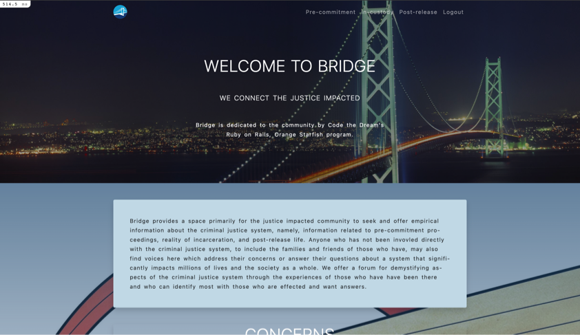
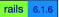
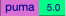

<p align="center"></p>
<h2 align="center">Bridge App</h2>
<h4 align="center">By Chung Kao</h4>
<p align="center">for Code the Dream, Orange Starfish 2022</p>
<p align="left"></p>

    

## About

The Bridge web app is a project completed by Chung Kao under the curriculum of the Code the Dream School, Ruby on Rails, Orange Starfish 2022 program, to fulfill the final project requirement under the program. It is built on a fork from a collaborative project of a team of trainees, including this author, of the Spring 2022 of Columbia University's Justice Through Code program. Although the original project is written in Python built on the Django framework, it is completely rewritten with Ruby on Rails except styling with the Bootstrap front-end library is retained.

The app is conceived as a forum in which community members may seek or offer information on topics intimate to the justice-impacted population. It seeks to connect those who are concerned about entering or exiting the corrections system with those who can offer information or insight specific to such conerns. Using the app's interactive message board anyone can ask a question, and anyone may offer an experiential response to the question, concerning any of the three broadly categorized areas of concern, namely, pre-commitment, in-custody, and post-release. In this way Bridge offers a wealth of information for persons and the families and friends of persons who come in the justice system.

### Usage

To clone and run this project locally you need to set up a development environment for Ruby on Rails, which includes the the following technology:

- Git
- Ruby
- Rails
- Node
- Yarn

You should also have a Ruby version manager such as RVM, rbenv, chruby, asdf indtalled. Mac users may use Homebrew to install the software (and the Ruby version manager rbenv) listed in the above. You don't need to install a database tool for this simple project; the SQLite3 that comes with Rails 6 sufficiently handles a project of this size.

There are plenty of resources online that guide you through setting up for Rails development. Please consult these sources and have the necessary software installed before attempting to download a copy of or clone this project.

The following commands are for Mac and Linux users. Windows users please execute equivalent commands. You may clone the project and check it out once you have the environment set up to run the app. But first verify by checking the versions of your installations:

```bash
$ git --version
$ ruby --version
$ rails --version
$ node --version
$ yarn --version
```

and

```
$ rbenv --version
```

if you're using it for Ruby version manager.

To clone a copy of this project using https, run the following command in the command line:

```bash
$ git clone https://github.com/Sanlung/ctd-rails-bridgeapp.git <your_project_directory_name>
```

To clone using SSH run the following command:

```bash
$ git clone git@github.com:Sanlung/ctd-rails-bridgeapp.git <your_project_directory_name>
```

Once the cloning is complete, you're ready to install the necessary Ruby gems and Node.js dependencies in your Rails environment, like so:

```
$ cd <path_to_your_local_project>
$ bundle install
$ yarn install
```

Create database and migrate schema:

```
$ bin/rails db:create
$ bin/rails db:migrate
```

Now run the server for the application:

```
$ bin/rails server
```

And you should see the app's welcome at `localhost:3000/welcome`.

You now have a Bridge app in which people may post questions and write answers to the questions.

Please let me know of any bugs and imperfections. Your input will be greatly appreciated. In case you decide to tweak the app further, please push up a branch to show me what you have done so I may learn form it.

### Contributor

[](https://github.com/Sanlung)

### License

MIT license
